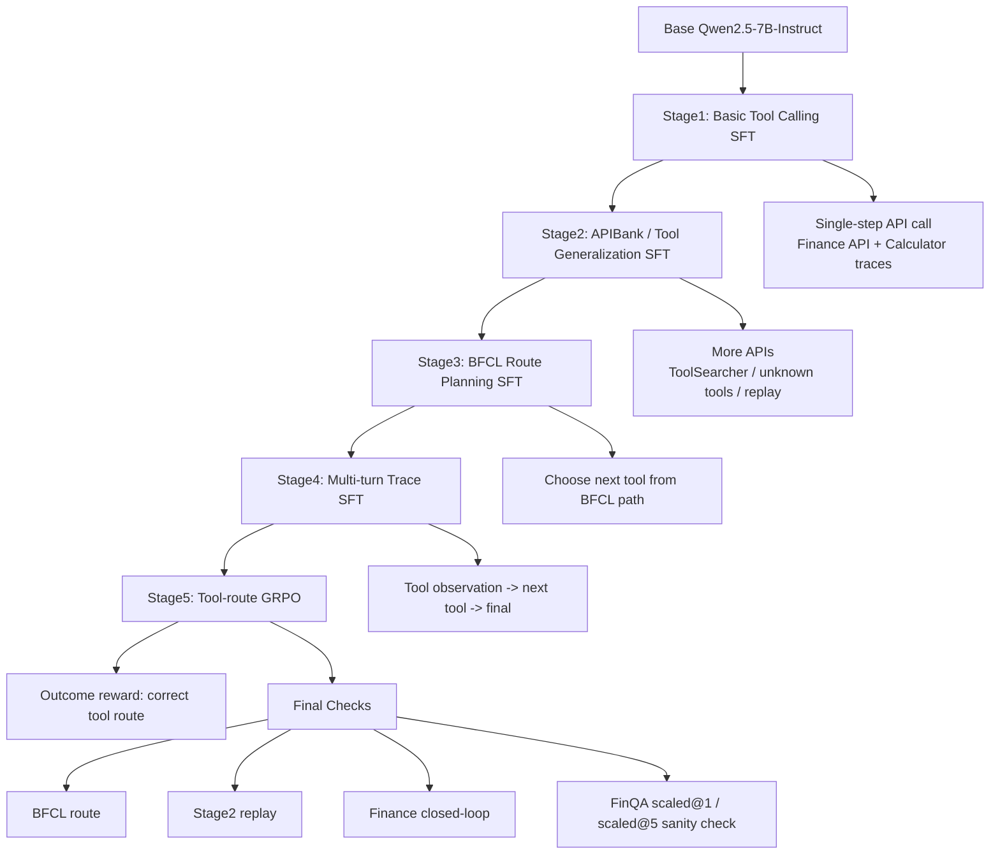

# Agent Stage1-5 Project Guide

这份文档整理的是我们在 Qwen2.5-7B-Instruct 上做的五阶段 tool-use / agent 训练流程。核心目标是把一个纯文本大模型，从“会输出答案”逐步训练成“会规划、会调用工具、会读 observation、会多轮执行，并能用 outcome reward 做小幅优化”的 agent。

本目录同时保存了核心代码、配置、指标和样例数据：

- `code/scripts/agent/`: 数据构造、训练、推理、评测脚本
- `code/configs/agent/`: LLaMA-Factory SFT 配置和工具 schema
- `code/metrics/`: Stage1-5 关键评测结果
- `code/data_samples/`: 每个阶段的典型训练样例

## Overall Flow



一句话理解：

Stage1 教模型“工具调用 JSON 长什么样”；Stage2 扩大工具分布；Stage3 教它“下一步该选哪个工具”；Stage4 教它“看到工具返回后继续多轮行动”；Stage5 不再纯模仿，而是用 reward 微调工具路由。

## Shared Output Format

Agent 阶段统一让模型输出 JSON action，而不是自然语言：

```json
{
  "action": "tool_call",
  "tool_call": {
    "name": "calculator",
    "arguments": {
      "expression": "2100.0/3000.0"
    }
  }
}
```

最终回答用：

```json
{
  "action": "final",
  "answer": "Amazon's market cap is about 0.70x Apple's."
}
```

这么做的好处是评测稳定：可以自动算 JSON valid、action accuracy、tool name accuracy、schema valid、closed-loop completion、final numeric accuracy。

## Stage1: Basic Tool Calling SFT

**目标**

让基础模型先具备最基本的 function calling 能力：看到用户任务后，能输出合法 JSON，能选择 `api_call`、`finance_api`、`calculator`，并在简单金融任务里完成多轮调用。

**训练方式**

- 方法：LoRA SFT
- 模型：Qwen2.5-7B-Instruct
- LoRA：rank 32, alpha 64, target `q_proj,k_proj,v_proj,o_proj`
- 数据：Gorilla APIBench + FinQA/toolcall-like finance synthetic traces
- 配置：`code/configs/agent/agent_stage1_sft_r32.yaml`
- 数据脚本：`code/scripts/agent/prepare_agent_stage1_data.py`

**样例数据**

- API 单步调用：`code/data_samples/stage1_gorilla_api_sample.json`
- 金融多轮调用：`code/data_samples/stage1_finance_multiturn_sample.json`

金融样例结构大概是：

```text
user: Compare Amazon's latest market cap to Apple's and calculate the ratio.
assistant: call finance_api(AMZN market_cap)
user: Tool observation ... value 2100.0
assistant: call finance_api(AAPL market_cap)
user: Tool observation ... value 3000.0
assistant: call calculator("2100.0/3000.0")
user: Tool observation ... result 0.7
assistant: final answer
```

**结果**

| Evaluation | Result |
|---|---:|
| Stage1 first-action dev JSON valid | 1.000 |
| Stage1 first-action dev tool acc | 1.000 |
| Gorilla heldout tool acc | 1.000 |
| Finance closed-loop completion | 0.9842 |

Stage1 的意义是打底。它已经能稳定输出工具调用格式，但工具种类和复杂多步规划还不够。

## Stage2: APIBank / Tool Generalization SFT

**目标**

扩大工具调用分布，让模型见到更多通用 API、ToolSearcher、医疗/保险/日程等非金融工具，提升“没见过具体业务也能输出工具调用”的泛化能力。

**训练方式**

- 方法：LoRA SFT，继续从 Stage1 adapter 训练
- 数据：APIBank lv1/lv2/lv3 + Stage1 replay
- Replay 目的：防止 Stage1 的 finance / Gorilla 能力遗忘
- 配置：`code/configs/agent/agent_stage2_sft_r32.yaml`
- 数据脚本：`code/scripts/agent/prepare_agent_stage2_data.py`
- Pipeline：`code/scripts/agent/run_stage2_pipeline.sh`

**样例数据**

- `code/data_samples/stage2_apibank_sample.json`

APIBank 样例通常包含一个任务、候选工具或工具说明，以及模型要调用的目标 API。很多工具不在我们的 `tool_schemas.json` 内，所以 schema valid 不能完全代表能力，主要看 tool name accuracy。

**结果**

| Evaluation | Result |
|---|---:|
| Stage2 dev tool acc | 0.978 |
| Stage2 dev JSON valid | 1.000 |
| Gorilla heldout tool acc | 1.000 |
| Finance closed-loop Num@1 | 0.9895 |
| Finance closed-loop Num@5 | 1.000 |

Stage2 说明模型已经不只是会固定的几个金融工具，而是开始具备更广的 API 调用泛化能力。

## Stage3: BFCL Route Planning SFT

**目标**

引入 BFCL multi-turn 数据，让模型学习“下一步该调用哪个工具”。这一步主要训练 tool routing / planning，而不是参数填充，因为 BFCL multi-turn 原始数据里可用的是 `path`，也就是工具名序列。

**训练方式**

- 方法：LoRA SFT，继续从 Stage2 adapter 训练
- 数据：BFCL multi-turn route 样本 + Stage2/Stage1 replay
- BFCL 样本格式：给 task conversation、previous selected tools、candidate tools，让模型输出下一个工具
- 配置：`code/configs/agent/agent_stage3_sft_r32.yaml`
- 数据脚本：`code/scripts/agent/prepare_agent_stage3_data.py`
- Pipeline：`code/scripts/agent/run_stage3_pipeline.sh`

**样例数据**

- `code/data_samples/stage3_bfcl_route_sample.json`

样例的核心是：

```text
Task conversation: ...
Previous selected tools: ...
Candidate tools:
- VehicleControlAPI.startEngine
- VehicleControlAPI.set_navigation
- ...

assistant: {"action":"tool_call","tool_call":{"name":"...","arguments":{}}}
```

**结果**

| Evaluation | Stage2 | Stage3 |
|---|---:|---:|
| BFCL route tool acc | - | 0.8017 |
| Stage2 dev replay tool acc | 0.978 | 0.976 |
| Gorilla heldout tool acc | 1.000 | 1.000 |
| Finance closed-loop Num@5 | 1.000 | 1.000 |

Stage3 的关键价值是：新增了 BFCL 工具路由能力，同时没有明显破坏 Stage1/2 的能力。

## Stage4: Multi-turn Trace SFT

**目标**

Stage3 只学“下一步工具”，Stage4 进一步训练完整多轮轨迹：模型要看到 tool observation，再决定下一步工具，最后输出 final。

这是从“会选工具”向“会跑 agent 流程”的关键一步。

**训练方式**

- 方法：LoRA SFT，继续从 Stage3 adapter 训练
- 数据：BFCL multi-turn trace + finance multi-turn traces + replay
- 训练样本数：6210
- 总训练步数：777
- 训练耗时：约 21 分 18 秒
- 配置：`code/configs/agent/agent_stage4_sft_r32.yaml`
- 数据脚本：`code/scripts/agent/prepare_agent_stage4_data.py`
- Pipeline：`code/scripts/agent/run_stage4_pipeline.sh`

**样例数据**

- `code/data_samples/stage4_bfcl_multiturn_trace_sample.json`

Stage4 BFCL trace 会把 path 展开成：

```text
assistant: call tool A
user: Tool observation from bfcl_router: {selected_tool: A, remaining_steps: ...}
assistant: call tool B
user: Tool observation from bfcl_router: {selected_tool: B, remaining_steps: ...}
assistant: final completed plan
```

这让模型开始学习 observation-conditioned planning。

**结果**

| Evaluation | Stage3 | Stage4 |
|---|---:|---:|
| BFCL route replay tool acc | 0.8017 | 0.8117 |
| BFCL multi-turn tool acc on tool turns | - | 0.7997 |
| BFCL multi-turn final exact | - | 1.000 |
| Finance multi-turn tool acc on tool turns | - | 1.000 |
| Stage2 dev replay tool acc | 0.976 | 0.976 |
| Gorilla heldout tool acc | 1.000 | 0.9989 |
| Finance closed-loop Num@1 | 0.9895 | 0.9895 |
| Finance closed-loop Num@5 | 1.000 | 1.000 |

Stage4 的表现是健康的：BFCL route 有小幅提升，finance 能力保持，Gorilla 只有极小下降。

## Stage5: Tool-route GRPO

**目标**

Stage1-4 都是 SFT，即模仿 gold trajectory。Stage5 开始做 outcome-style 优化：让模型采样多个候选输出，根据 reward 判断工具是否选对，强化 BFCL/tool-route 能力。

**训练方式**

- 方法：GRPO，继续从 Stage4 adapter 训练
- 数据：Stage3 route hard samples + Stage4 turn samples + Stage1/2 replay
- 训练样本：6400
- 训练步数：600
- `num_generations`: 8
- `max_prompt_length`: 2048
- `max_completion_length`: 96
- learning rate: `3e-7`
- 数据脚本：`code/scripts/agent/prepare_agent_stage5_grpo.py`
- 训练脚本：`code/scripts/agent/train_stage5_grpo_toolroute.py`
- Pipeline：`code/scripts/agent/run_stage5_pipeline.sh`

**Reward 设计**

Stage5 reward 主要看：

- JSON 是否有效
- 是否输出 `tool_call`
- tool name 是否非空
- tool name 是否等于 gold tool
- 如果不是完全正确，但属于同一个 API class，给少量 partial credit
- 输出过长或格式外废话扣分

简化理解：Stage5 不再只问“你有没有模仿训练答案”，而是问“你选的工具是否能拿 reward”。

**样例数据**

- `code/data_samples/stage5_grpo_route_sample.json`

Stage5 样例包含：

```json
{
  "prompt": [...],
  "gold_output": "...",
  "gold_tool": "TravelAPI.get_flight_cost",
  "source": "bfcl_multiturn_route"
}
```

**结果**

| Evaluation | Stage4 | Stage5 |
|---|---:|---:|
| BFCL route tool acc | 0.8117 | 0.8167 |
| Stage2 replay tool acc | 0.976 | 0.976 |
| Finance closed-loop Num@1 | 0.9895 | 0.9895 |
| Finance closed-loop Num@5 | 1.000 | 1.000 |

Stage5 有提升，但提升不大。训练日志里后期 `reward_std` 经常为 0，说明 8 个采样回答已经很一致，GRPO 的相对优势信号偏弱。这个现象很重要：继续普通 GRPO 不一定划算，下一步更适合 hard-negative DPO/ORPO。

## FinQA Cross-task Check

我们还把 Stage5 agent model 拿去跑了 FinQA full dev 883 条，作为跨任务 sanity check。

| Metric | Stage5 Agent on FinQA dev |
|---|---:|
| JSON valid | 0.9468 |
| Numeric Acc@1 | 0.3124 |
| Numeric Acc@5 | 0.3982 |
| Scaled Numeric Acc@1 | 0.3421 |
| Scaled Numeric Acc@5 | 0.4405 |

这个结果明显低于 FinQA 专用 SFT/DPO/tool-call 模型，是正常的。Stage5 agent 的目标是通用工具路由，不是 FinQA financial numerical reasoning。它能维持较高 JSON valid，但 FinQA 计算准确率不是这个阶段的优化目标。

## Code Implementation Steps

下面是从工程角度看，每个 stage 实际做了什么。

### 1. 数据构造

- Stage1: `prepare_agent_stage1_data.py`
  - 合并 Gorilla APIBench 和 synthetic finance agent traces
  - 输出 LLaMA-Factory sharegpt 格式
- Stage2: `prepare_agent_stage2_data.py`
  - 加入 APIBank / ToolSearcher 类数据
  - 混入 Stage1 replay
- Stage3: `prepare_agent_stage3_data.py`
  - 读取 BFCL multi-turn `path`
  - 构造 next-tool routing 样本
  - 加入 Stage1/2 replay
- Stage4: `prepare_agent_stage4_data.py`
  - 将 BFCL path 展开成多轮 trace
  - 构造 synthetic observation
  - 保留 finance multi-turn traces
- Stage5: `prepare_agent_stage5_grpo.py`
  - 把 route/turn 样本转成 GRPO prompt + gold_tool 格式
  - 加入 replay 防遗忘

### 2. 训练

- Stage1-4 使用 LLaMA-Factory SFT 配置：`code/configs/agent/*.yaml`
- Stage5 使用 TRL GRPO：`train_stage5_grpo_toolroute.py`
- 每个新阶段都从上一个阶段 adapter 继续训练，而不是从 base model 重新来
- 所有阶段都使用 LoRA rank32，训练参数量约 20M

### 3. 推理与评测

- `infer_agent_action.py`
  - 读取 prompt 或 messages
  - 加载 base model + adapter
  - 生成 action JSON
- `eval_agent_first_action.py`
  - 解析 JSON
  - 计算 action accuracy、tool name accuracy、schema valid
- `build_agent_turn_eval.py`
  - 把完整多轮 messages 拆成每个 assistant turn 的评测样本
- `run_finance_agent_controller.py`
  - 真正做 closed-loop controller
  - 模型输出 tool_call
  - controller 返回 finance_api/calculator observation
  - 模型继续调用或 final
  - 最后算数值准确率

### 4. 防遗忘设计

每个新阶段都会混 replay：

- Stage2 混 Stage1 replay
- Stage3 混 Stage2 + Stage1 replay
- Stage4 混 Stage3 + Stage2 + Stage1 replay
- Stage5 混 Stage2/Stage1 replay

这也是为什么后面加 BFCL 和 GRPO 后，finance closed-loop 仍保持 Num@5 = 1.0，Stage2 replay 仍保持 0.976。

## How To Explain This In An Interview

可以这样讲：

1. 我不是直接训练一个“万能 agent”，而是把能力拆成五层：格式、工具泛化、路由规划、多轮 observation、outcome reward。
2. 每一阶段都有明确的自动评测，而不是只看 loss。
3. 我用了 replay 控制遗忘，所以后续加入新能力时，旧任务指标基本不掉。
4. Stage5 的 GRPO 提升小，原因不是模型没学，而是 reward variance 变低，说明采样探索不足。这给出了下一步方法：hard-negative DPO/ORPO。

## Metric Glossary

- `json_valid_rate`: 模型输出能否被解析成 JSON
- `action_accuracy`: `tool_call` / `final` / `clarify` 是否选对
- `tool_name_accuracy`: 工具名是否和 gold tool 一致
- `tool_name_accuracy_on_gold_tool_turns`: 只在 gold 是工具调用的轮次上计算工具名准确率
- `argument_schema_valid_rate`: 参数是否符合已注册 schema。BFCL 工具没有注册 schema，所以该指标在 BFCL 上通常是 0，不代表模型错
- `completion_rate`: closed-loop 中模型是否最终输出 final
- `tool_success_rate`: controller 是否成功执行工具
- `final_numeric_acc_1pct / 5pct`: final answer 的数值是否在 gold 的 1% / 5% 容差内
- `scaled_numeric_accuracy`: 对百分号、单位 scale 做兼容后的数值准确率

## Main Takeaways

- Stage1-2 解决“会不会调用工具”和“能否泛化到更多 API”。
- Stage3 解决“多工具任务下一步选谁”。
- Stage4 解决“观察工具结果后继续行动”。
- Stage5 尝试用 reward 优化工具路由，得到小幅提升。
- 当前最明显瓶颈不是 JSON 格式，而是相近工具混淆。
- 后续 Stage6 最值得做 hard-negative DPO/ORPO，而不是继续普通 GRPO。

## Suggested Stage6 Direction

Stage6 应该专门利用 Stage5 的错误样本构造 chosen/rejected pairs：

```text
prompt: 原始任务 + 候选工具 + 当前 observation
chosen: 正确 tool_call
rejected: Stage5 真实生成的错误 tool_call
```

这样能直接压低混淆工具，例如：

- `TravelAPI.get_flight_cost` vs `TravelAPI.book_flight`
- `GorillaFileSystem.diff` vs `GorillaFileSystem.cat/cp/cd`
- `TradingBot.remove_stock_from_watchlist` vs `TradingBot.get_watchlist`
- `ToolSearcher` vs 直接调用具体 API

这会比继续 GRPO 更有针对性。
