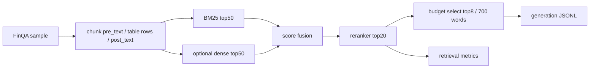

# FinQA Chunked RAG Upgrade

## Goal

Replace the coarse FinQA RAG flow with a cleaner retrieval stack:

1. Split each FinQA report into evidence chunks.
2. Retrieve candidate chunks with BM25, optionally plus dense retrieval.
3. Fuse candidate scores.
4. Rerank candidates with a cross-encoder reranker when available.
5. Select top chunks under a context budget.
6. Build generation inputs and retrieval metrics.

## Files

- `remote_files/scripts/finqa/run_finqa_chunked_rag.py`
  - Main implementation.
  - Builds chunks from `pre_text`, `post_text`, and table rows.
  - Can read either the Hugging Face FinQA dataset or local SFT JSONL generated earlier.
  - Runs BM25 retrieval, optional dense retrieval, score fusion, reranking, and budgeted context selection.
- `remote_files/scripts/finqa/run_chunked_rag_dev.sh`
  - One-command dev pipeline.
  - Defaults to `models/bge-reranker-base` if present.
  - Falls back to lexical rerank if the reranker model is missing.

## Architecture



## Metrics

The script writes:

- `recall_at_1`
- `recall_at_3`
- `recall_at_5`
- `recall_at_8`
- `recall_at_15`
- `avg_chunks_per_sample`
- `avg_selected_context_words`

Recall is computed over chunks marked as gold evidence using FinQA `gold_inds` when the gold evidence can be mapped to chunk text or ordinal hints.

## Remote Command

```bash
cd /root/autodl-tmp/gui-grounding-agent
bash scripts/finqa/run_chunked_rag_dev.sh
```

The default runner uses `data/finqa/processed/sft/dev.jsonl`, so it does not need external Hugging Face access.

Optional dense retrieval:

```bash
DENSE_MODEL=models/bge-small-en-v1.5 RERANKER_MODEL=models/bge-reranker-base \
  bash scripts/finqa/run_chunked_rag_dev.sh
```

## Outputs

- `outputs/finqa/rag/chunked_rag_dev_retrieval.jsonl`
- `external/LLaMA-Factory/data/finqa_chunked_rag_dev.jsonl`
- `outputs/finqa/metrics/chunked_rag_dev_retrieval_metrics.json`

The generation JSONL keeps only retrieved evidence instead of the full FinQA context, so it can be used to test whether RAG compresses context while preserving answer quality.
