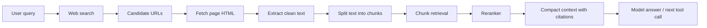

# Web Chunked RAG

## Why This Exists

The earlier FinQA RAG pipeline retrieves chunks from the FinQA report context. That is useful for evaluating context compression on a fixed dataset, but it is not the web-search RAG used by the agent.

The agent RAG should work like this:



## Files

- `remote_files/scripts/agent/web_chunked_rag.py`
  - Search web with Bing HTML, then DuckDuckGo fallback.
  - Inject curated financial data URLs for market-cap queries, for example CompaniesMarketCap pages for Tesla and Apple.
  - Fetch candidate pages.
  - Strip HTML and split page text into overlapping chunks.
  - Retrieve chunks lexically.
  - Rerank chunks with BGE reranker when `BGE_RERANKER_PATH` exists.
  - Return `rag_context`, `selected_chunks`, and `citations`.

- `remote_files/scripts/agent/langchain_tool_agent.py`
  - The existing `web_search` tool now calls `web_chunked_rag(...)` first.
  - If chunked web RAG fails, it falls back to the older search-result snippet reranker.

## Tool Output

The `web_search` tool now returns:

- `rag_context`: compact evidence text passed back to the model.
- `selected_chunks`: the actual page chunks selected after retrieval/reranking.
- `citations`: source title, URL, and chunk id.
- `search_results`: original web search results.
- `fetch_reports`: page fetch success/error metadata.
- `reranker`: BGE reranker path or lexical fallback name.

## Example

```bash
cd /root/autodl-tmp/gui-grounding-agent
PYTHONPATH=. python scripts/agent/web_chunked_rag.py \
  "Tesla market cap Apple market cap difference today" \
  --max_search_results 6 \
  --final_top_k 5
```

## Relationship To Calculator Tool

For questions like "What is the difference between Tesla's market cap and Apple's market cap?", the intended controller flow is:

1. Model calls `web_search`.
2. `web_search` searches the web and injects known financial data pages when the query is about market cap.
3. The tool fetches pages, chunks page text, retrieves relevant chunks, and reranks them.
4. `web_search` returns chunked RAG context with cited market-cap evidence.
5. Model extracts the two numeric values.
6. Model calls `calculator`.
7. Model returns the final answer with citations and calculation.

So RAG supplies evidence; calculator handles exact arithmetic.
